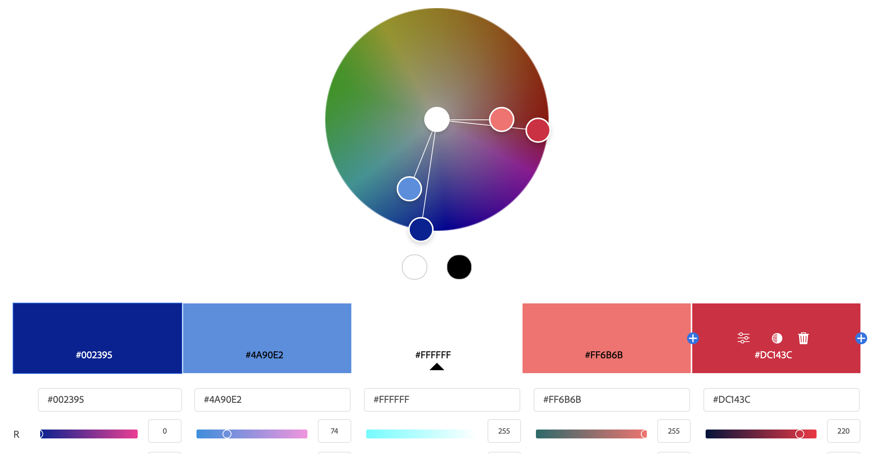
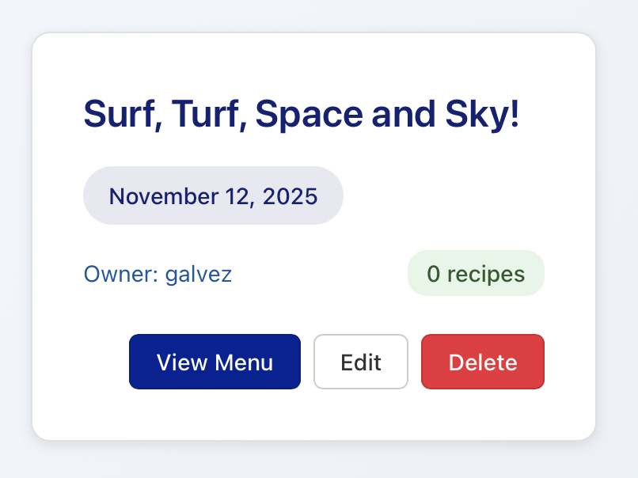
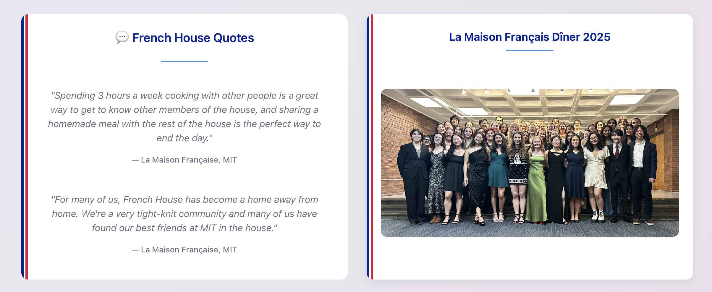

# Color Styling + Layout

By far the visual aspect that I played around with the most and thoroughly enjoyed bringing some life into the application through some of the coloration features I was able to think of. I hope that you will enjoy them as much as I do!

## Color Palette

For some context into the actual colors themselves, I should disucss how I decided my color palette. My application "Menu Manager" is meant for my living group "La Maison Français" (The French House), and that is why I had to incorporate the Blue + White + Red that is on the French flag.

To expand on just the three colors, I decided to go with a sort of "Split Complimentary" color palette with "Monochromatic" touch to incorporate different shades of the primary colors. This came together for a 5-color palette: French Blue, Light Blue, White, French Red, Light Red.

## Menu Coloring

With this new color palette I was able to and combine the french flag colors in different ways, starting with the simplest of three buttons with the french flag colors:

Although simple, the coloring not only provides visual pleasure but also helps tell the user the function of the buttons like the "Red" for "Delete".

## French Bar

Although less functional then the previous this one I liked simply for easthetic and the beauty I thought it brought to the application. I wanted the bland boxes to be a little more than just white boxes so I thought to give them borders, but why not have nice colorful borders instead of just a black or gray?

## Hovering

Finally, the last case of using coloring to try to make the application more functional for the user, is to use coloring when hovering to illustrate an action.

The "focus color" of my application is the dark blue, but I was able to pair it with the french red to illustrate actions across the site. A prime example is whenever hovering over a box:

