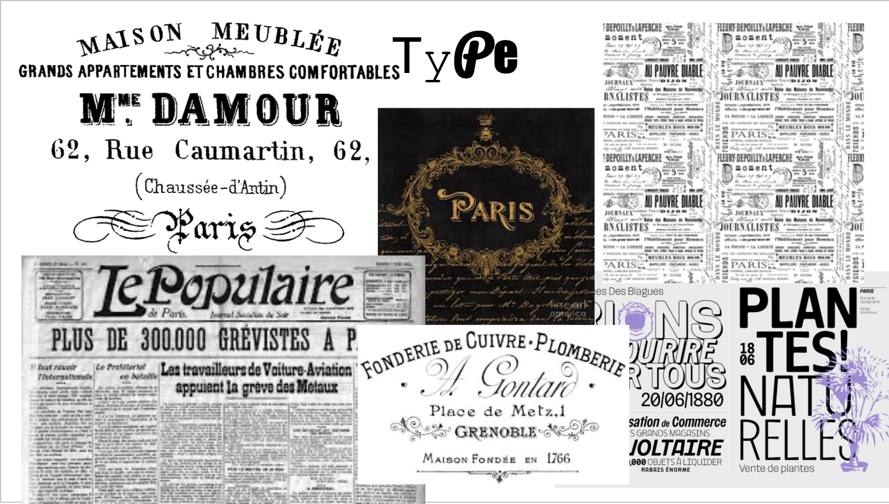

# Typography Design Study

From my design study the biggest thing that I gathered from it was that the french usually use a lot of uppercase letters, along with much curvier fonts. Particularly the Garamond font!

